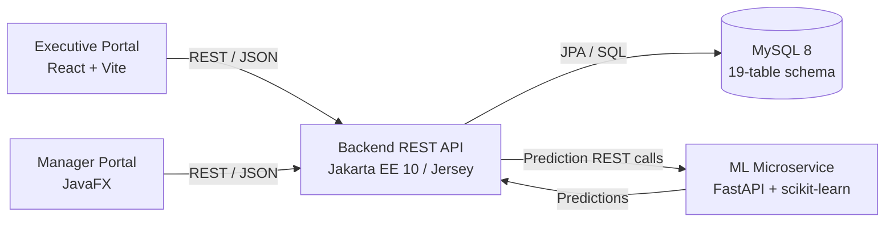

# SPAS

## Sales & Marketing Predictive Analytics System

SPAS is a BSc (Hons) Software Engineering final-year project for Ceylinco General Insurance. It was developed for the CIS6035 module at Cardiff Metropolitan University / ICBT Campus.

The system combines operational sales activity capture, management reporting, relational data storage, and predictive analytics. It is organised as a monorepo containing five cooperating components:

- `backend/`: Jakarta EE REST API and application services
- `executive/`: web portal for sales executives
- `manager/`: desktop portal for managers
- `db/`: MySQL schema and seed scripts
- `ml/`: FastAPI microservice serving the trained machine-learning models

## Architecture

The components communicate through REST endpoints. The React executive portal and JavaFX manager portal use the Jakarta EE backend for application operations. The backend persists business data in MySQL and calls the ML microservice for predictive results. The ML service loads the two trained scikit-learn models and returns predictions to the backend.



The machine-learning service exposes two prediction functions:

1. Activity outcome classification
2. Sales executive monthly target-hit forecasting

## Technology Stack

| Component | Technologies |
| --- | --- |
| Backend API | Java 17, Jakarta EE 10, JAX-RS/Jersey, EclipseLink JPA, Maven, GlassFish 7, MySQL Connector/J, JWT, BCrypt |
| Executive portal | JavaScript, React 18, Vite, React-Bootstrap, Bootstrap 5, React Router, Sass |
| Manager portal | Java 11, JavaFX 13, Maven, Jackson |
| Database | MySQL 8, SQL schema and seed scripts |
| ML microservice | Python 3.12, FastAPI, Uvicorn, scikit-learn 1.6.1, pandas, NumPy, joblib |

## Repository Structure

```text
SPAS/
├── backend/       Jakarta EE 10 REST API Maven project
├── executive/     React + Vite sales executive portal
├── manager/       JavaFX 13 manager portal Maven project
├── db/            MySQL schema and seed data
├── ml/            FastAPI machine-learning microservice
├── context/       Project reports, planning notes, and supporting documentation
└── README.md      Monorepo documentation
```

The subprojects contain their own source layouts and configuration files. The `executive/` and `ml/` folders also contain component-specific README files:

- [Executive portal README](executive/README.md)
- [ML service README](ml/README.md)

## Prerequisites

Install the following before setting up the components:

- Git
- Java 17 and Maven for `backend/`
- Java 11 and Maven for `manager/`
- GlassFish 7 for deploying the backend WAR
- Node.js and npm for `executive/`
- MySQL 8 and a MySQL client
- Python 3.12 for `ml/`

The backend and manager target different Java versions. Use a Java 17 environment for the backend build and a Java 11 environment for the manager build, or configure the corresponding Maven toolchains locally.

## Setup

### 1. Database

Create a MySQL 8 database and run the schema script from the repository root using a MySQL client. The script creates the SPAS relational schema, including the 19-table application schema and its initial data where defined.

```bash
mysql -u <username> -p < db/spas_db_synthetic_seed.sql
```

Additional seed scripts are available in `db/seeding/` for sales executives, clients, sales, activity logs, achievements, and client feedbacks. Run only the seed scripts required for the local environment and check the database credentials expected by the backend configuration before starting the applications.

### 2. Backend REST API

The backend is a NetBeans Maven web application packaged as a WAR file. It uses Jakarta EE 10 APIs, EclipseLink JPA, and MySQL Connector/J, and is intended to run on GlassFish 7.

```powershell
cd backend
mvn clean package
```

Deploy the generated `backend/target/backend-1.0.war` to GlassFish 7 and configure the application datasource, JPA persistence settings, and environment-specific secrets for the local MySQL instance. The exact deployment and server configuration depend on the local GlassFish installation.

### 3. Executive Portal

The executive portal is a React/Vite application. Its component README contains the functional description and current demo behaviour.

```powershell
cd executive
npm install
npm run dev
```

Vite prints the local development URL, normally `http://localhost:5173`. The current portal includes local mock data and local-storage persistence for its standalone development flow. Its API integration can be configured when the backend is available.

For a production-style build:

```powershell
npm run build
npm run preview
```

See [executive/README.md](executive/README.md) for the implemented workflows and backend integration notes.

### 4. Manager Portal

The manager portal is a JavaFX 13 desktop application built with Maven and maintained as a NetBeans project.

```powershell
cd manager
mvn clean package
mvn clean javafx:run
```

The JavaFX Maven plugin is configured with `lk.spas.manager.App` as the main class. Ensure that the manager's API configuration points to the running backend before using manager features that require REST access.

### 5. ML Microservice

The ML service requires Python 3.12 because the model artifacts depend on `scikit-learn==1.6.1`.

```powershell
cd ml
py -3.12 -m venv venv
.\venv\Scripts\Activate.ps1
python -m pip install --upgrade pip
pip install -r requirements.txt
uvicorn app.main:app --reload
```

The service provides:

- `GET /health`
- `POST /predict/activity-outcome`
- `POST /predict/se-target-forecast`

See [ml/README.md](ml/README.md) for the component-specific environment and endpoint notes. The service is intended to receive calls from the backend rather than direct calls from the frontend.

## Development Notes

- Start MySQL before the backend when using database-backed functionality.
- Start the ML service before requesting prediction features through the backend.
- Start the backend before connecting the executive portal or manager portal to live API endpoints.
- Keep credentials, local environment files, generated build output, virtual environments, and dependency directories out of version control. The repository root `.gitignore` contains the shared monorepo rules.
- The `context/` directory contains project documentation and supporting material and is intentionally ignored by Git in the local development workspace.

## Academic Scope

SPAS demonstrates a multi-component software system with a REST-based integration layer, a relational persistence layer, separate user interfaces for sales executives and managers, and a machine-learning service for predictive decision support. The components can be developed and run independently, while the backend provides the main integration boundary for the complete system.
